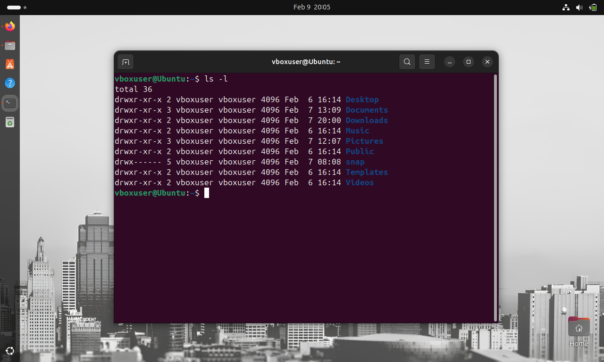
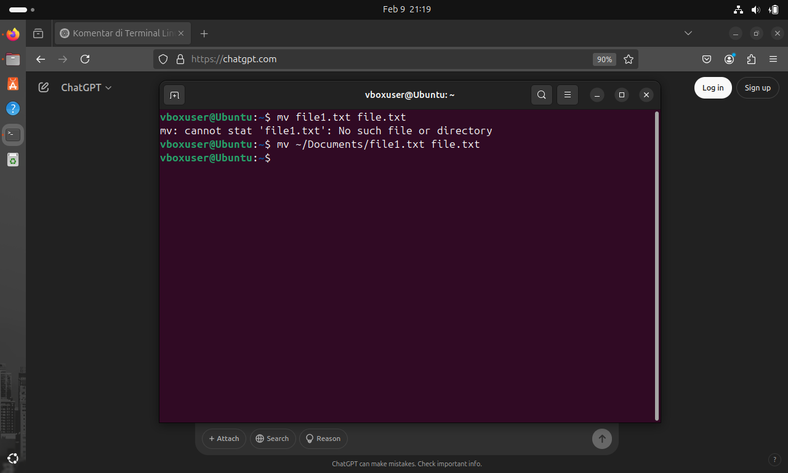

📌Laporan Praktikum 2 Jaringan Komputer

Nama : M. Rizky Taufik Nur Hidayat

NIM  : 09030582327076

Kelas: TK4B

<h1 style="font-weight: bold;">
  50 Komentar Dasar Terminal Linux Ubuntu
</h1 >

<ol>
  <li></li>
  
Perintah ls digunakan untuk menampilkan daftar file dan direktori dalam suatu direktori.

  <li></li>
  
ls -l Menampilkan daftar dalam format panjang dengan informasi seperti izin, pemilik, ukuran, dan waktu modifikasi.

  <li></li>
  
ls -a Menampilkan semua file, termasuk file tersembunyi (dimulai dengan titik (.).

  <li></li>
  
Perintah ls -R digunakan untuk menampilkan daftar file dan direktori secara rekursif. Ini berarti ls akan menampilkan isi dari direktori saat ini beserta seluruh subdirektorinya.

  <li></li>
  
Perintah cd berfungisi untuk change direktory, artinya berpindah direktory 

  <li></li>
  
Perintah cd - berfungsi untuk berpindah ke direktory terakhir sebelum perpindahan terakhir

  <li></li>
  
Perintah pwd berfungsi untuk menapilkan path direktory kerja saat ini

  <li></li>
  
Perintah touch file1.txt berfungsi untuk membuat file baru dengan nama file1.txt

  <li></li>
  
Perintah echo "" >> file1.txt berfungsi untuk menyisipkan kata yang diinginkan ke dalam file1.txt

  <li></li>
  <li></li>
  
Perintah nano file1.txt berfungsi untuk membuka dan mengedit file1.txt

  <li></li>
  
Perintah cat file1.txt berfungsi untuk menampilkan isi dari file1.txt

  <li></li>
  
Perintah cat > file1.txt berfungsi untuk menyisipkan isi secara langsung ke file1.txt

  <li></li>
  
Perintah cp file1.txt ~/Documents berfungsi untuk mengcopy file ke direktory Documents

  <li></li>
  
Perintah mv file1.txt ~/Downloads berfungsi untuk memindahkan file1 ke direktory Downloads

  <li></li>
  
Perintah rm: remove regular file '/hoem/vboxuser/Downloads/file1.txt'?  berfungsi untuk menghapus file di direktory Downloads dengan persetujuan

  <li></li>
  
Perintah mkdir Sistem_Operasi berfungsi untuk membuat direktory baru dengan nama Sistem Operasi

  <li></li>
  
Perintah rmdir Sistem_Operasi berfungsi untuk menghapus direktory dengan nama Sistem Operasi

  <li></li>
  
Perintah mkdir ~/Sistem_Operasi/Baru/ berfungsi untuk membuat direktory Baru di dalam direktory

  <li></li>
  
Perintah rm -rf Sistem_Operasi berfungsi untuk menghapus direktory beserta isinya secara paksa

  <li></li>
  
Perintah head ~/Documents/file1.txt berfungsi untuk membuka 10 baris pertama dari file1.txt

  <li></li>
  
Perintah tail ~/Documents/file1.txt berfungsi untuk membuka 10 baris terakhir dari file1.txt

  <li></li>
  
Perintah tail -f ~/Documents/file1.txt berfungsi untuk membuka secara real time 10 baris terakhir dari file1.txt

  <li></li>
  
Perintah grep "Contoh" ~/Documents/file1.txt berfungsi untuk mencari dan menampilkan banyak dari teks Contoh di dalam file1.txt 

  <li></li>
  
Perintah grep -r "Contoh" berfungsi untuk mencari teks "Contoh" dalam semua file secara rekursif di dalam direktori saat ini dan subdirektorinya.

  <li></li>
  
Perintah history berfungsi menampilkan seluruh riwayat komentar yang pernah digunakan

  <li></li>
  
Perintah kill pid berfungsi untuk menghentikan proses yang berjalan berdasarkan Process ID (PID).

  <li></li>
  
Perintah ps berfungsi untuk menampilkan daftar proses yang sedang berjalan di sistem.

  <li></li>
  
Perintah top berfungsi untuk menampilkan informasi real-time tentang proses yang sedang berjalan, termasuk penggunaan CPU, memori, dan berbagai statistik sistem lainnya.

  <li></li>
  
Perintah free berfungsi untuk menampilkan informasi tentang penggunaan memori pada sistem, termasuk memori fisik, swap, dan buffer cache.

  <li></li>
  
Perintah chmod 755 ~/Documents/file1.txt berfungsi memberikan izin akses sesuai yang dijelaskan di atas pada file file1.txt yang berada di dalam direktori Documents.

  <li></li>
  
Perintah df berfungsi untuk menampilkan informasi tentang penggunaan disk pada sistem file, termasuk ruang kosong dan terpakai.

  <li></li>
  
Perintah df -h berfungsi menampilkan hasil dalam format yang lebih ramah pengguna, seperti MB atau GB.

  <li></li>
  
Perintah lsblk berfungsi untuk menampilkan informasi tentang perangkat penyimpanan blok (block devices), seperti hard drive, SSD, dan partisi.

  <li></li>
  
Perintah uname a berfungsi untuk menampilkan informasi lengkap tentang sistem operasi dan kernel yang sedang berjalan.

  <li></li>
  
Perintah cd / berfungsi untuk masuk ke direktory root

  <li></li>
  
Perintah cd  berfungsi untuk masuk kembali ke direktory user

  <li></li>
  
Perintah wc ~/Documents/file1.txt berfungsi untuk menghitung jumlah baris, kata, dan karakter dalam file1.txt.

  <li></li>
  
Perintah date berfungsi menampilkan tanggal dan waktu

   <li></li>
  
Perintah sudo apt update berfungsi untuk memperbarui daftar paket (package list) dari repositori yang terdaftar pada sistem. Ini akan memastikan bahwa sistem mengetahui paket terbaru yang tersedia untuk diinstal atau diperbarui.

  <li></li>
  
Perintah sudo apt install whatsapp berfungsi untuk menginstall package whatsapp

  <li></li>
  
Perintah sudo apt remove whatsapp berfungsi untuk menghapus package whatsapp

  <li></li>
  
Perintah sudo apt install whatsapp berfungsi untuk menampilkan daftar veris paket yang terinstal dari package "wireshark"

  <li></li>
  
Perintah cat /etc/passwd berfungsi untuk menampilkan isi file /etc/passwd, yang berisi informasi tentang akun pengguna yang terdaftar di sistem.

  <li></li>
  
Perintah uptime berfungsi untuk menampilkan waktu sistem telah berjalan sejak terakhir kali boot, bersama dengan informasi lainnya seperti jumlah pengguna yang sedang login dan beban sistem.

  <li></li>
  
Perintah mv ~/Documents/file1.txt file.txt berfungsi untuk memindahkan dan mengganti nama file1.txt menjadi file.txt

  <li></li>
  
Perintah ^C berfungsi membatalkan atau menghentikan proses yang sedang berjalan di terminal.

  <li></li>
  
Perintah clear berfungsi membersihkan layar terminal

  <li></li>
  
Perintah pstree berfungsi untuk menampilkan pohon (tree) proses yang sedang berjalan di sistem. Ini menunjukkan hubungan hierarkis antara proses induk dan anaknya dalam bentuk pohon.

  <li></li>
  
Perintah test -e ~/Documents/file.txt && echo "File ada" || echo "File tidak ada" berfungsi untuk memeriksa apakah file tertentu ada di sistem, dan kemudian menampilkan pesan yang sesuai.

  <li></li>
  
Perintah echo "Hello World" berfungsi untuk menampilkan teks di terminal

  <li></li>
  
Perintah evince.pdf berfungsi untuk menampilkan isi file format pdf

 
</ol>

